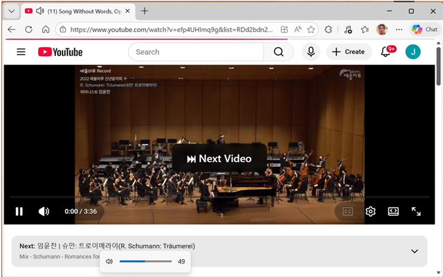
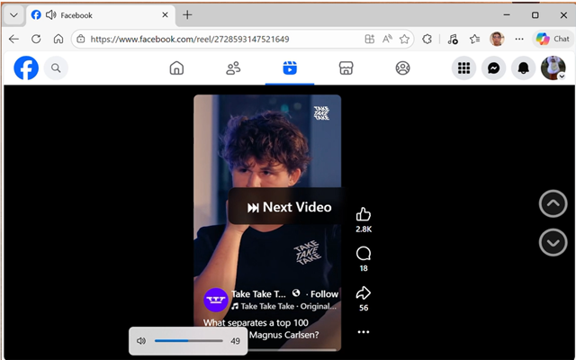
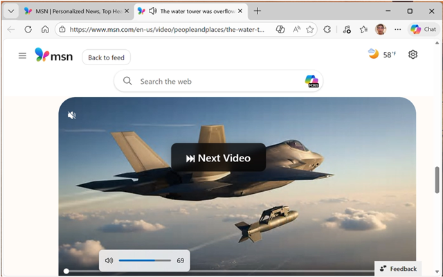

# Volume Gesture — Video Navigator

[](https://opensource.org/licenses/MIT)
[](https://github.com/jengliang/volumeGesture/releases/tag/v4.1.0)
[](https://microsoftedge.microsoft.com/addons/detail/dafhmbjblhplgpnbkbhajnpheaenfdcb)

**Microsoft Edge extension + Windows native host** — navigate between videos with your headset’s hardware volume buttons (Bluetooth or wired). Works even when the browser is minimized on many sites (see [Limitations](#limitations)).

This README documents **[v4.1.0](https://github.com/jengliang/volumeGesture/tree/v4.1.0)** ([release](https://github.com/jengliang/volumeGesture/releases/tag/v4.1.0), [`manifest.json` at this tag](https://github.com/jengliang/volumeGesture/blob/v4.1.0/manifest.json)).

## Screenshots

| YouTube | Facebook |
|:-------:|:--------:|
|  |  |

| MSN |
|:---:|
|  |

## Contents

- [Screenshots](#screenshots)
- [Gestures](#gestures)
- [Supported sites](#supported-sites)
- [Requirements](#requirements)
- [Install](#install)
- [Verify](#verify)
- [Settings](#settings)
- [Troubleshooting](#troubleshooting)
- [Limitations](#limitations)
- [Uninstall](#uninstall)
- [Building from source](#building-from-source)
- [Privacy](#privacy)
- [Contributing](#contributing)
- [License](#license)

## Gestures

| Action | Gesture |
|--------|---------|
| **Next video** | Volume Up then Down (within the configured gesture window, 1–4 s) |
| **Previous video** | Volume Down then Up (within the configured gesture window, 1–4 s) |

A translucent overlay briefly confirms each detected gesture.

## Supported sites

- **YouTube** — built-in next/previous navigation
- **Facebook** — scrolls between videos in feed, Watch, and Reels
- **MSN** — scroll-to-play feed; each gesture scrolls the page (see **Feed scroll** in Settings)
- **Other sites** — finds next/previous buttons or scrolls between video elements

## Requirements

- **OS:** Windows (native host uses the Windows audio APIs and registry-based native messaging registration)
- **Browser:** [Microsoft Edge](https://www.microsoft.com/edge) (Chromium)
- **Hardware:** Headset or device whose volume keys change **Windows master volume** (not device-only volume that bypasses the OS)

## Install

### Step 1: Install the extension

**Recommended:** install from the Microsoft Edge Add-ons store:

[**Volume Gesture — Video Navigator**](https://microsoftedge.microsoft.com/addons/detail/dafhmbjblhplgpnbkbhajnpheaenfdcb)

After a store install, the extension ID is **`dafhmbjblhplgpnbkbhajnpheaenfdcb`** (the native host installer uses this as the default).

**Sideload (development):**

1. Open `edge://extensions/`
2. Turn on **Developer mode**
3. Click **Load unpacked** and choose this repository’s root folder (where `manifest.json` lives)
4. Copy the **Extension ID** shown under the extension name

### Step 2: Install the native host

The native host watches system volume and detects hardware button patterns. The extension cannot work without it.

1. Download **`native-host-4.1.0.zip`** from the **[v4.1.0 release](https://github.com/jengliang/volumeGesture/releases/tag/v4.1.0)**  
   ([direct download](https://github.com/jengliang/volumeGesture/releases/download/v4.1.0/native-host-4.1.0.zip))
2. Extract to a permanent folder (for example `C:\VolumeGesture\`)
3. Run **`install.bat`**
4. When prompted for the extension ID:
   - Press **Enter** to use the default **`dafhmbjblhplgpnbkbhajnpheaenfdcb`** (store install), or
   - Paste the ID from `edge://extensions/` if you sideloaded
5. Restart Edge

## Verify

Open DevTools (**F12**) on any tab. In **Console**, you should see:

```
[VolumeGesture] Native host status: connected
```

## Settings

Open the extension’s toolbar popup to:

- **Enable/disable** gesture detection
- **Gesture window** — max time between volume changes (1000–4000 ms, default 1000 ms)
- **Feed scroll** — on scroll-to-play sites (e.g. MSN), how far each gesture scrolls (80–100% of the viewport, default 100%)

## Troubleshooting

| Issue | What to do |
|-------|------------|
| Console shows “Native host disconnected” | Check **`debug.log`** in the native host folder |
| “Access to the specified native messaging host is forbidden” | Extension ID in the registry manifest does not match your install. Run **`install.bat`** again and enter the ID from `edge://extensions/` |
| Overlay appears but the video does not change | The site may have changed. [Open an issue](https://github.com/jengliang/volumeGesture/issues) |
| False triggers from repeated presses | Increase the gesture window in settings, or update to the latest release |
| Gestures stop after switching audio output | The native host re-acquires the device periodically; wait a moment and try again |

## Limitations

- Some headsets use **device-local** volume that does not change Windows master volume. Volume Gesture only sees OS-level changes — use controls that adjust **Windows** volume.
- When Edge is **minimized**, Facebook may not run page scripts reliably; navigation can queue until the window is restored. Keeping Edge on the desktop (even in the background) avoids this. YouTube is generally fine when minimized.
- The Edge store ships the **extension** only. The **native host** is distributed separately via **GitHub Releases**.

## Uninstall

1. Remove the extension in `edge://extensions/`
2. In the native host folder, run **`uninstall.bat`** to remove the native messaging registry entry

If you no longer have that folder, remove the registration manually (then delete any leftover files):

```bat
reg delete "HKCU\Software\Microsoft\Edge\NativeMessagingHosts\com.volgesture.volumemonitor" /f
```

## Building from source

Source for this version: **[v4.1.0](https://github.com/jengliang/volumeGesture/tree/v4.1.0)** ([zip](https://github.com/jengliang/volumeGesture/archive/refs/tags/v4.1.0.zip)).

### Package the extension (store / sideload ZIP)

```bash
python build.py
```

Use **Python 3.7+**. The output ZIP name follows **`manifest.json`** `version` (`volumeGesture-<version>.zip`).

To also build the **native host** bundle for a GitHub release (same layout as **`native-host-4.1.0.zip`**; includes **`volume_monitor.exe`** when that file is present under `native_host/`):

```bash
python build.py --native-host
```

That produces **`native-host-<version>.zip`** in addition to the extension ZIP.

### Build the standalone native host

On **Windows** with **Python 3.8+**:

```bash
cd native_host
build_exe.bat
```

Produces **`volume_monitor.exe`** (PyInstaller). See the `native_host` folder for installer scripts.

## Privacy

Volume Gesture does not collect user data. Details: [PRIVACY.md](PRIVACY.md).

## Contributing

Bug reports and pull requests are welcome via [Issues](https://github.com/jengliang/volumeGesture/issues) and pull requests on this repository.

## License

[MIT](LICENSE)
